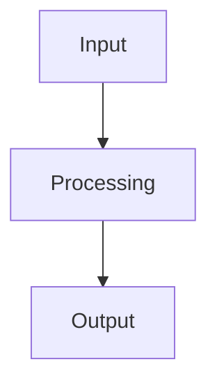

# Architecture

> This document describes the system design and component structure. Keep it updated as the project evolves.

## Overview

<!-- High-level summary of the system. What does it do? How does data flow through it? -->

## System Diagram

<!-- Add a diagram when the system has multiple components. Mermaid works in GitHub:



-->

## Project Structure

<!-- Update as the project takes shape. Example:

```
src/
  api/            # API layer
  core/           # Core business logic
  models/         # Data models / schemas
  pipelines/      # Data processing pipelines
  services/       # External service integrations
  utils/          # Shared utilities
tests/
docs/
```

-->

## Core Components

### <!-- Component 1 -->

<!-- Describe each major component. What is it responsible for? What are its invariants? -->

### <!-- Component 2 -->

## Data Stores

<!-- What databases, caches, or file stores does the system use? What data lives where? -->

| Store | Purpose | Schema |
|-------|---------|--------|
| <!-- name --> | <!-- purpose --> | <!-- schema or link --> |

## External Integrations

<!-- LLM providers, APIs, model registries, vector databases, etc. -->

| Service | Purpose | Auth |
|---------|---------|------|
| <!-- name --> | <!-- what you use it for --> | <!-- API key / OAuth / etc. --> |

## Model Management

<!-- If using ML models, describe the lifecycle: training, versioning, serving, monitoring. -->

- **Model format**: <!-- GGUF, ONNX, PyTorch, etc. -->
- **Storage**: <!-- Where model artifacts are stored -->
- **Versioning**: <!-- How model versions are tracked -->
- **Inference**: <!-- How models are served -->

## Deployment

<!-- How is this deployed? Docker, Kubernetes, serverless, local? What are the infrastructure requirements? -->

## Security

<!-- Authentication, authorization, data encryption, secrets management, input validation. -->

## Development Environment

<!-- How to set up a local dev environment. Prerequisites, env vars, seed data, etc. -->

---

## References

- [architecture.md specification](https://architecture.md/) — Architecture-as-code specification
- [docs/agent-files-guide.md](./docs/agent-files-guide.md) — Practical guide for writing effective architecture documentation
